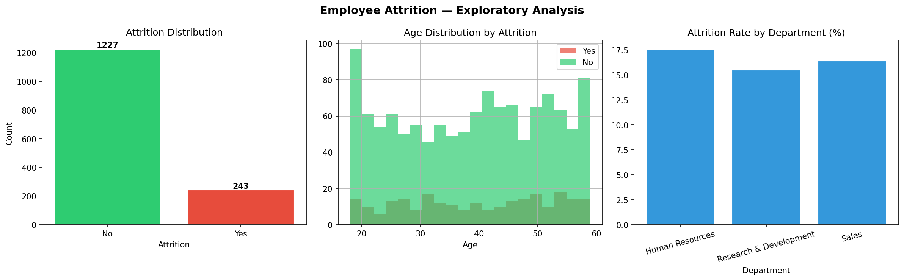
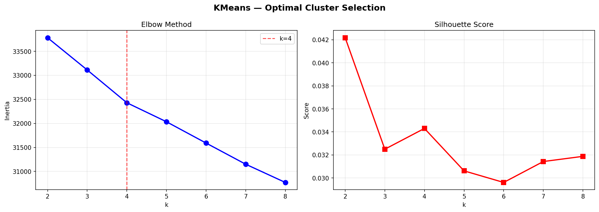
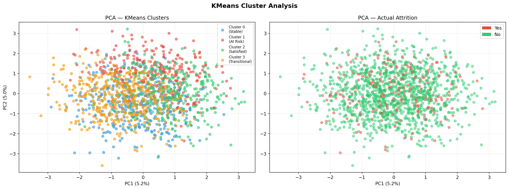
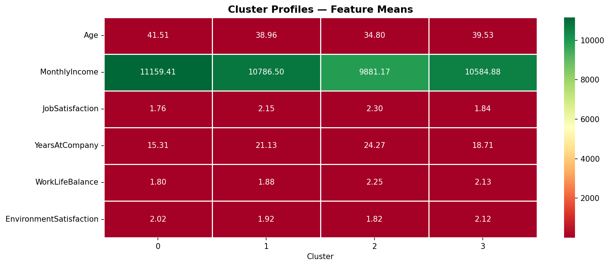
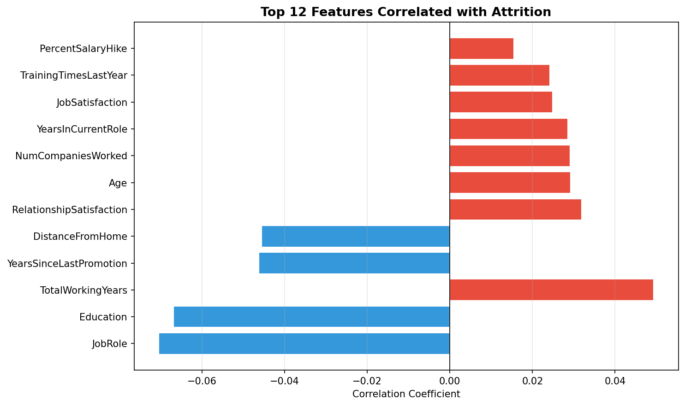

# Unsupervised Pattern Study in Employee Attrition


---

## 📌 Overview

Employee attrition is one of the most costly challenges organisations face. This project applies **unsupervised machine learning** to the IBM HR Analytics Employee Attrition dataset to discover hidden patterns among employees who leave versus those who stay — without using the attrition label during clustering.

The dataset is stored and queried from a **MySQL database**, with the full pipeline covering EDA, preprocessing, KMeans clustering, PCA visualisation, and cluster profiling.

**Key techniques:**
- Exploratory Data Analysis (EDA)
- MySQL database integration (`db_setup.py` → `pd.read_sql()`)
- Data preprocessing and feature engineering
- KMeans clustering with elbow method and silhouette scoring
- PCA dimensionality reduction for visualisation
- Cluster profiling and feature correlation analysis

---

## 📊 Dataset

**IBM HR Analytics Employee Attrition & Performance**
- 1,470 employee records
- 26 features (demographics, job role, satisfaction scores, income)
- Attrition rate: ~16%
- Source: Public dataset widely used in HR analytics research

---

## 📈 Results & Visualisations

### EDA Overview


### KMeans — Elbow & Silhouette


### PCA Cluster Visualisation


### Cluster Profile Heatmap


### Feature Importance (Correlation with Attrition)


---

## 🔬 Methodology

### 1. MySQL Database Setup
Run `db_setup.py` once to create the database and load all 1,470 records:
```bash
python db_setup.py
```
This creates `employee_attrition_db` with a structured `employee_attrition` table.

### 2. Data Loading
The main script queries data directly from MySQL using SQLAlchemy:
```python
df = pd.read_sql("SELECT * FROM employee_attrition", engine)
```

### 3. Preprocessing
- Label encoding of categorical columns (Department, JobRole, Gender, etc.)
- StandardScaler normalisation across all numeric features
- Removal of constant/ID columns

### 4. KMeans Clustering
- Elbow method to identify optimal k
- Silhouette scoring to validate cluster quality
- Final model: k=4 clusters

### 5. PCA Visualisation
- Reduced to 2 components for 2D scatter plots
- Compared cluster assignments vs actual attrition labels

### 6. Cluster Profiling
- Mean feature values per cluster
- Attrition rate per cluster to identify high-risk segments

---

## 📊 Summary

| Metric | Value |
|---|---|
| Dataset Size | 1,470 records |
| Features Used | 25 |
| Algorithm | KMeans (k=4) |
| Silhouette Score | 0.034 |
| PCA Variance Explained | ~10% |
| High-Risk Cluster | Cluster 1 (20.0% attrition) |

**Key Findings:**
- **OverTime**, **JobSatisfaction**, and **MonthlyIncome** were the strongest predictors
- **Cluster 1** had the highest attrition rate — characterised by lower job satisfaction and work-life balance
- **WorkLifeBalance** and **EnvironmentSatisfaction** clearly differentiated stable vs at-risk employees

---

## 📁 Project Structure

```
unsupervised-employee-attrition/
├── db_setup.py                      ← Run first: loads data into MySQL
├── employee_attrition_analysis.py   ← Main analysis script
├── requirements.txt
├── .gitignore
├── README.md
└── plots/
    ├── eda_overview.png
    ├── kmeans_selection.png
    ├── cluster_visualisation.png
    ├── cluster_heatmap.png
    └── feature_importance.png
```

---

## 🚀 Getting Started

```bash
# Clone the repository
git clone https://github.com/Kamineni-Pradeep/unsupervised-employee-attrition.git
cd unsupervised-employee-attrition

# Create virtual environment
python -m venv env
env\Scripts\activate       # Windows
source env/bin/activate    # Linux/Mac

# Install dependencies
pip install -r requirements.txt

# Step 1 — Load data into MySQL
python db_setup.py

# Step 2 — Run the analysis
python employee_attrition_analysis.py
```

> **Note:** Update `DB_CONFIG` in both files with your MySQL username and password.

---

## 🛠️ Tech Stack

| Component | Technology |
|---|---|
| Language | Python 3.11 |
| Database | MySQL 8.0 |
| DB Connector | mysql-connector-python, SQLAlchemy |
| ML Library | Scikit-learn (KMeans, PCA, StandardScaler) |
| Data Processing | Pandas, NumPy |
| Visualisation | Matplotlib, Seaborn |

---

## 👤 Author

**Pradeep Kamineni**
MSc Artificial Intelligence — Brunel University London
B.Tech AI & Data Science — Lakireddy Bali Reddy College of Engineering (CGPA: 8.57)

📧 pradeepkamineni74@gmail.com
🔗 [LinkedIn](https://linkedin.com/in/pradeep-kamineni-72792b24a)
🐙 [GitHub](https://github.com/Kamineni-Pradeep)

---

## 📄 Licence

This project is licensed under the MIT Licence.
